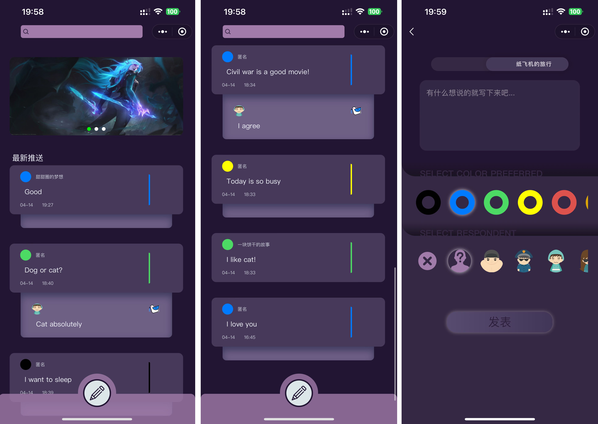

# Whisper
A safe haven for sharing secrets or pouring out one's heart.

## Story
The app, named 'Shudong' (directly translated as 'Tree Hole'), refers to a concept in Chinese culture where one can safely share secrets or pour out their emotions. True to its name, the app does not record any personal information of its users, allowing them to speak freely. I have also given it an English name, 'Whisper', which might be more understandable to non-Chinese speakers.

## Tech Stack
1. Spring Boot
2. vue
3. MySQL
4. Docker

## Deploy
### Note
1. The WeChat Mini Program Account: ```树洞撑了把伞```
2. The server IP address: ```35.238.239.226```

### Front-end: ```WeChat Mini Program```
1. set up the server address
2. upload the code to WeChat Mini Program Platform
3. set to experience version
4. then you can scan the QR code with WeChat to request access permission

### Back-end: ```Google Cloud```
1. Install MySQL / Docker
2. run ```sudo docker pull lyuanzhi/shudongback:v1```
3. run ```docker run -d -p 8082:8082 lyuanzhi/shudongback:v1```
4. check using ```lsof -i:8082```

### Demo Screenshots

